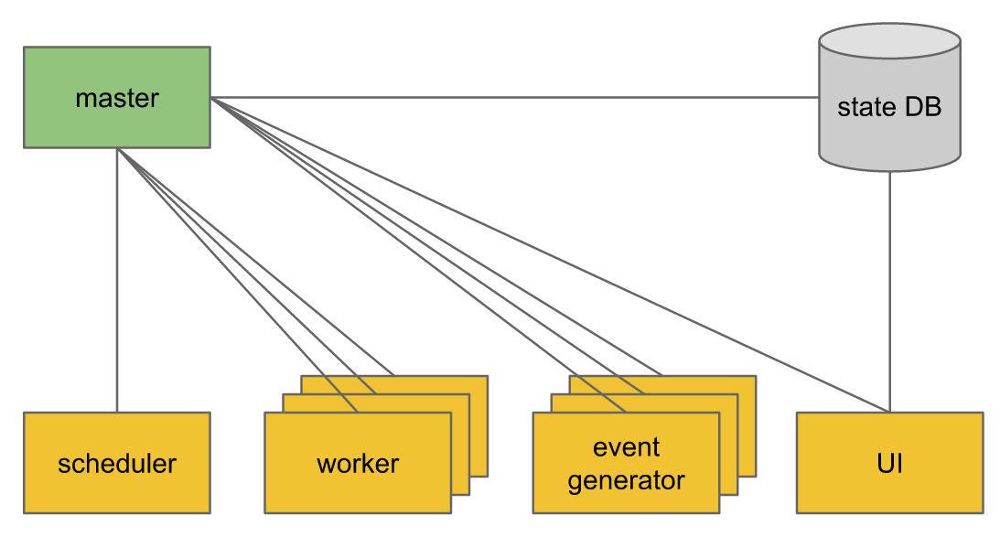
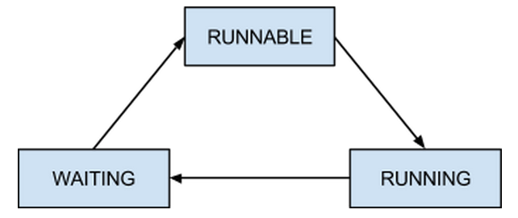

=============================
Pinball Architecture Overview
=============================

Pinball is a scalable **workflow management platform** developed at Pinterest. 
It is built based on layered approach. The base layer provides a generic master-worker model. 
Master maintains the system state represented by a collection of abstract tokens. 
Tokens are claimed and modified by workers implementing application specific logic.
The application layer introduces tokens specific to workflows, workers implementing the job 
execution logic, a parser converting workflow specification to a collection of tokens, a scheduler 
allowing us to prepare workflow execution ahead of time, and a UI for manual control and monitoring.

Workflow model
----------------
A *workflow* is a connected graph of *nodes* called *jobs* connected with directed edges representing 
dependencies. A node has zero or more *inputs* and *outputs*. Inputs correspond to outgoing dependencies 
while outputs are defined by incoming dependencies. Since outputs of an upstream job are defined by inputs 
of its downstream dependents, only inputs have to be specified explicitly.

A special type of external input does not have a connecting edge. Such inputs are usually defined by top-level jobs 
and provide a way to trigger the workflows from outside (i.e., by a scheduler).

A job may execute only if there is at least one event in each of its inputs. An example of an event is an item 
representing completion of a job or creation of a file.  A job execution consumes exactly one event from each input. 
After a successful run, a job produces an event and sends it along its output edges.

At a given time, a job is in one of the following states:

* WAITING: some of the input dependencies are missing.
* RUNNABLE: all input dependencies are satisfied, the job is ready to go,
* RUNNING: the job is being executed.

Here is the job state machine:

The state machine is extremely simple which makes it easy to understand, implement, and debug. Note that there is 
no SUCCEEDED/FAILED state. After a run finishes, it’s status gets recorded in the job history and the job transitions 
to the WAITING state; there is no DISABLED state for jobs that should be ignored per user request. We describe the 
implementation of this functionality below.

Workflow runtime components
---------------------------
Components running a workflow are modeled as a master-worker architecture. 
The master maintains the system state. The decision making and job execution 
logic lives in the worker implementation.

State
~~~~~
A workflow element (e.g., job) is represented as a *token*, which has the following fields:

* *version* - a value that gets incremented each time a token is modified. Version may (but does not have to) be implemented as the timestamp of the last modification,
* *name* - a unique name of the token. Names are structured hierarchically (e.g., /workflows/some_workflow/some_job),
* *owner* - an identity of the worker that currently owns the token. The value of this field is not interpreted but it should be unique across clients,
* *ownership* expiration time - the timestamp at which the token becomes claimable,
* *data* - the application specific data stored in the token - e.g., a definition of a job.

Workflow tokens
~~~~~~~~~~~~~~~
A workflow is represented by two types of tokens:

* *JobToken* - represents a job. It contains job configuration (e.g., the name of the corresponding Job), execution history (within this workflow instance), and lists of triggering events (for the current and historic runs),
* *EventToken* - represents a state change - e.g., completion of a job, creation of a file. Events are posted to a job’s inputs and they get consumed (i.e., moved inside JobTokens) when the job runs. Since a job execution is fully specified by the list of triggering events, re-running a job is as simple as re-posting those events.

Naming structure
~~~~~~~~~~~~~~~~
Workflow token names are structured hierarchically.

* JobTokens are stored under /current_workflows/<workflow_name>/<workflow_instance_id>/<job_name>
* EventTokens are stored under /current_workflows/<workflow_name>/<workflow_instance_id>/<job_name>/<input_name>

After a workflow execution finishes, all its tokens are moved atomically under /historic_workflows/. 
Only tokens under /workflows/ are modifiable through the master interface (see next section). 
Tokens in /historic_workflows/ are accessed by the UI server (see below).

Master
~~~~~~~
Master is a frontend to a persistent state repository with an interface supporting atomic token updates. The interface accepts the following requests:

* Insert([list of tokens]): atomically inserts tokens on the list into the repository. The version values of the inserted tokens get initialized by the master and returned to the client,
* Update([list of tokens]): atomically updates tokens on the list. Input tokens are required to exist in the repository,
* Delete([list of tokens]): atomically removes tokens on the list from the repository.
* Get(name_prefix): get the list of tokens with names matching a given prefix.

Keep things simple is the design principle:

* master keeps the entire state in memory,
* each state update gets synchronously persisted before master replies to the client. This way if the master crashes, it can recover by reading the state from the storage,
* master runs in a single thread so there are no concurrency issues.

Worker
~~~~~~
Worker is a client of the master. It does the following: ::
  
  while (true) {
    job = master.get_RUNNABLE_job();
    if (job) {
      change job state to RUNNING;
      run the job;
      if job failed {
        depending on the config, either abort the workflow or do nothing (i.e., continue with other jobs);
      } else {
        post events to downstream jobs and check if some of them can be made RUNNABLE;
        if all inputs of the job are satisfied {
          make the job RUNNABLE
        } else {
          make the job WAITING
        }
      }
    }
  }

Other Components
-----------------
Workflow configuration
~~~~~~~~~~~~~~~~~~~~~~~
This configuration tells pinball where to find the definition of workflows and jobs.

Parser
~~~~~~~~
Parser converts a workflow configuration to a set of tokens and posts them in a single atomic call to the master. Jobs with no inputs will be posted in state RUNNABLE. All other jobs will be WAITING.

Scheduler
~~~~~~~~~
Scheduler is responsible for running workflows on a schedule. It has (or knows how to find) workflow configurations. When the time comes, it invokes parser with a given workflow config.

UI
~~~
UI is implemented as a service reading directly from the storage layer used by the master (e.g., MySql). The reason why the UI won’t go through the master is that the master keeps only the state of the currently running workflows while the UI should be able to show also historic executions.

Some properties of the outlined architecture
--------------------------------------------

* The model is dead-simple. 
* The isolation of the workflow-specific worker logic from the generic master semantics makes this architecture extremely extensible. One can implement custom workers running custom jobs on top of the basic task model.
* Multiple instances of the same workflow can run concurrently as long as the tokens representing their jobs have unique names.
* It’s easy to control the parallelism - we can dynamically add and remove workers.
* Cyclic job dependencies are supported out-of-the-box.
* Continuous/streaming workflows are supported as well.
* To disable a job, one can simply change its token’s expiration time to infinity.
* The system is easy to debug and fix - individual components are generally stateless and the authoritative system state is stored in a single place - the storage layer written to by the master. So if something goes wrong we can investigate by looking at that state and at any point we can put the system in any state by overwriting the underlying data.

